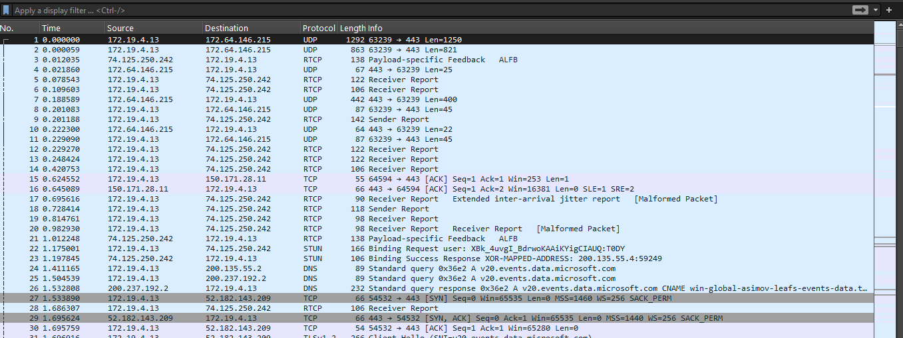
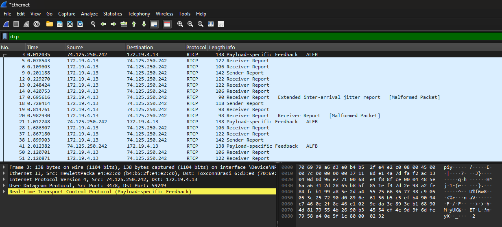

# Relatório de Laboratório: Qualidade de Serviço (QoS) - A Otimização da Jornada dos Pacotes

**Disciplina:** Redes de Computadores II
**Professora:** Angelita Rettore de Araujo

**Nome do Aluno:** Thierry Marcoff

**Turma:** 6 Fase
---

## 1. Introdução

Este laboratório aborda a **Qualidade de Serviço (QoS)**, um conjunto de mecanismos importantes para gerenciar o tráfego de rede e assegurar que aplicações críticas recebam tratamento preferencial. Diferente dos laboratórios anteriores que focaram na confiabilidade (garantir que os pacotes cheguem), o objetivo aqui é garantir que os pacotes cheguem *com qualidade* – ou seja, com a latência, jitter, throughput e perda de pacotes adequados.

A importância da QoS é contextualizada pela **narrativa da telecirurgia**, onde cada pacote de comando tátil, voz ou dado vital do paciente é crucial. Atrasos, variações irregulares na chegada ou perda de pacotes podem ter consequências catastróficas.

## 2. Objetivos

Os principais objetivos deste laboratório são:
1.  **Compreender e medir** os conceitos fundamentais de Latência, Jitter, Throughput, Perda de Pacotes e Classificação de Tráfego no contexto de QoS.
2.  **Configurar e executar simulações** no **Network Simulator 2 (NS2)** para observar o comportamento da rede sob diferentes condições de QoS.
3.  **Utilizar o Wireshark** para capturar e analisar o tráfego de rede, medindo parâmetros de QoS em tempo real.
4.  **Analisar o impacto** da variação dos parâmetros de QoS no desempenho de diferentes tipos de aplicações.
5.  **Comparar a tolerância a perdas e a sensibilidade à latência e jitter** de diversas aplicações.
6.  **Propor soluções** baseadas em QoS para otimizar o desempenho de aplicações críticas em cenários de rede desafiadores.

## 3. Ferramentas Utilizadas

*   **Network Simulator 2 (NS2)**: Ambiente de simulação de rede para modelar cenários.
*   **Wireshark**: Analisador de protocolo de rede para captura e inspeção de pacotes em tempo real.
*   **Acesso à Internet**: Para testes com ferramentas online (como Google Meet).

---

## 4. Parte I: Relembrando a Jornada – Preparando o Ambiente

**Contexto Teórico:** A narrativa da cirurgia remota é a base para entender a importância dos "pacotes heróis" (Pablo, Melody, Flash e Data) e como a QoS é vital para a missão deles de salvar uma vida.

### **4.1. Verificação e Configuração Inicial do NS2**

*   Confirmei a instalação do NS2 e criei o arquivo `qos_base.tcl`.

**Entrega:** Captura de tela do `qos_base.tcl` no editor de texto.


### **4.2. Configuração Inicial do Wireshark**

*   Abri o Wireshark e selecionei a interface de rede correta para captura.

**Entrega:** Captura de tela do Wireshark com a interface de captura selecionada.


---

## 5. Parte II: Latência (Delay) – O Tempo é Essencial

**Contexto Teórico:** A latência é o tempo que um pacote leva para ir da origem ao destino, como o tempo para o comando tátil do Dr. Martinez (Flash) chegar ao bisturi em Manaus.

### **5.1. Simulação de Latência no NS2**

*   Criei e executei o script `lab_latencia.tcl`, experimentando diferentes valores para `link_delay` (ex: 10ms, 100ms, 500ms).

**Entrega:** O código `lab_latencia.tcl` utilizado.
```tcl
# lab_latencia.tcl
# Simulação de Latência (Delay)

# 1. Importação do Arquivo Base
source qos_base.tcl

# 2. Criação dos Nós
set n0 [$ns node]
set n1 [$ns node]

# 3. Criação do Link com Latência Variável
# Experimente diferentes valores para o delay (ex: 10ms, 100ms, 500ms)
set link_delay "450ms" ;# Latência do link
create_link $n0 $n1 $default_bw $link_delay $default_queue

# 4. Criação dos Agentes e Aplicações
set udp0 [new Agent/UDP]
$ns attach-agent $n0 $udp0
set cbr0 [new Application/Traffic/CBR]
$cbr0 attach-agent $udp0
$cbr0 set packetSize_ 1000
$cbr0 set interval_ 0.01 ;# 100 pacotes/segundo
set null0 [new Agent/Null]
$ns attach-agent $n1 $null0
$udp0 set class_ 0 ;# Para identificação no trace
$ns connect $udp0 $null0

# 5. Agendamento de Eventos
$ns at 0.5 "$cbr0 start"
$ns at 4.5 "$cbr0 stop"
$ns at 5.0 "finish"

# 6. Início da Simulação
$ns run
```

### **5.2. Análise da Latência no Arquivo de Trace (.tr)**

*   Analisei o arquivo `lab_latencia.tr`, identificando o envio e recebimento de pacotes para calcular a latência de ponta a ponta.

**Entrega:** Trecho do arquivo `.tr` destacando um pacote enviado e seu respectivo recebimento.
```
+ 0.51 0 1 cbr 1000 ------- 0 0.0 1.0 1 1
- 0.51 0 1 cbr 1000 ------- 0 0.0 1.0 1 1
r 0.793 0 1 cbr 1000 ------- 0 0.0 1.0 1 1
```

**Cálculos da Latência:**

| `link_delay` Configurado | Timestamp Envio | Timestamp Recebimento | Latência Calculada |
| :----------------------- | :-------------- | :-------------------- | :----------------- |
| 0,1   | 0,5        | 0,608          | 0,108       |
| 0,45 | 0,5         | 0,958               | 0,458       |
|0,275  | 0,51         | 0,793               | 0,283        |

### **5.3. Perguntas para Refletir e Discutir**

1.  **Qual a relação entre o `link_delay` configurado no script e a latência medida no arquivo `.tr`?**
    *   A latência medida e o tempo de link_delay ficaram muito próximas, com todos contendo uma diferença na casa dos 0,008s. Possivelmente essa diferença ocorre pelo tempo de transmissão  que é 0,008s. O tempo de transmissão foi calculado sendo o tamnho do pacote (packetSize) 1000 bytes (8000 bits) dividido pela largura de banda (default_bw) 1 Mb --> 8.000/1.000.000 = 0,008.
2.  **Como a latência afeta a percepção do usuário em aplicações como VoIP ou jogos online?**
    *   Ela degrada a experiência do usuário, gerando lags, travamentos, vozes cortadas e desssincronizadas, falta de resposividade entre outros.
3.  **Se o Dr. Martinez estivesse em Tóquio e o paciente em Manaus, qual seria o impacto na latência?**
    *   A latência poderia aumentar devido a grande distância. A mensagem precisaria passar por diferentes redes a fim de percorrer as dezenas de milhares de quilômetros, o que aumenta o tempo de propagação e tempo de processamento (precisará passar por muito mais roteadores e switches). O Jitter também poderia aumentar significativamente devito as múltiplas rotas possíveis e congestionamento. 

---

## 6. Parte III: Jitter e Perda de Pacotes – A Variação Inesperada e o Preço da Imperfeição

**Contexto Teórico:** **Jitter** é a variação no atraso dos pacotes, causando "voz robotizada" (pacotes de Melody). A **perda de pacotes** ocorre quando um pacote não chega, sendo a tolerância variável por aplicação (pacotes de Data). O **RTCP (Real-Time Control Protocol)** é utilizado por aplicações em tempo real (como Google Meet) para reportar a qualidade da transmissão, incluindo jitter e perda.

### **6.1. Análise do Jitter e Perda de Pacotes no Wireshark (Captura Local de RTCP)**

*   Iniciei uma chamada no Google Meet e capturei o tráfego com o Wireshark.
*   Filtrei o tráfego por `rtcp` e identifiquei os tipos de pacotes (SR, RR, SDES, Bye).
*   Analisei os **Receiver Reports (RR)** para localizar os campos `Fraction Lost`, `Cumulative Number of Packets Lost` e `Interarrival Jitter`.

**Entregas:**

1.  Captura de tela do Wireshark mostrando a captura inicial de pacotes.
    
2.  Captura de tela do Wireshark mostrando o filtro `rtcp` aplicado.
    
3.  Captura de tela dos detalhes de um pacote **Receiver Report (RR)**, com os campos `Fraction Lost`, `Cumulative Number of Packets Lost` e `Interarrival Jitter` claramente visíveis.
   

**Valores Observados:**

*   **Interarrival Jitter:** 4150381963 ms
*   **Fraction Lost:** 2/256 ou 0,78%
*   **Cumulative Number of Packets Lost:**  -1531507 (deve ser um bug estar negativo)

### **6.2. Perguntas para Refletir e Discutir**

1.  **Como esses valores de Jitter e Fraction Lost se comparam aos limites aceitáveis para uma boa qualidade de voz/vídeo (ex: jitter idealmente abaixo de 30ms, perda abaixo de 1%)?**

* Após repetir o teste algumas vezes, os valores obtidos apresentaram uma mistura de resultados realistas e estranhos, o que sugere a ocorrência de um bug na forma como o Wireshark interpretou os pacotes RTCP.

    * Fraction Lost: O valor medido foi de 0,78% (2/256), o que está dentro do limite aceitável para uma boa qualidade de vóz e vídeo em tempo real (valor deve ser inferior a 1%).

    * Interarrival Jitter: O valor medido foi de 4.150.381.963 ms, um número irrealista extremamente irrealista. Este valor é resultado de um provável erro de leitura da ferramenta. Um valor normal e aceitável seria abaixo de 30 ms. Manter o jitter baixo é crucial para evitar que o áudio soe "robotizado" ou "picotado" e que o vídeo tenha interrupções.

2.  **Por que o RTCP é essencial para aplicações em tempo real, mesmo que o RTP (dados de mídia) esteja criptografado?**

* O RTCP é essencial porque funciona como o "painel de controle" da transmissão, fornecendo informações vitais sobre a qualidade da entrega dos pacotes, independentemente do conteúdo deles.
* Enquanto o RTP tem a função em transportar os dados de mídia (voz e vídeo), que podem ser criptografados, o RTCP opera em paralelo para monitorar a "saúde da conexão". Ele reporta métricas cruciais como a quantidade de pacotes perdidos, a variação no tempo de chegada (jitter) e o tempo de ida e volta (round-trip time).

3.  **Como as informações de jitter e perda de pacotes reportadas pelo RTCP podem ser usadas pela aplicação (Google Meet) para ajustar a qualidade da transmissão?**

* As informações de jitter and packet loss reportadas pelo RTCP servem como um mecanismo de feedback em tempo real, permitindo que aplicações como o Google Meet se adaptem em tempo real às condições da rede para preservar a experiência do usuário. Por exemplo: 
    * Em caso de alta Perda de Pacotes: a aplicação pode reduzir a taxa de bits (bitrate), por exemplo por diminuir a qualidade do vídeo (ex: de 1080p para 720p) ou do áudio. Isso resulta em pacotes menores ou menos pacotes por segundo, o que alivia o congestionamento na rede e reduz a probabilidade de novas perdas.
    * Em caso de alto Jitter: a aplicação receptora pode aumentar o tamanho do buffer de de-jitter. Na prática significa aumentar um pequeno atraso proposital (buffer) para armazenar os pacotes recebidos por alguns milissegundos a mais antes de exibi-los. Isso dá tempo para que os pacotes que chegam atrasados sejam reordenados e apresentados na sequência correta, suavizando a reprodução e evitando o efeito "picotado".

---

## 7. Parte IV: Throughput vs. Responsividade – O Dilema da Rede

**Contexto Teórico:** **Throughput** é a quantidade de dados em um tempo (Pablo/vídeo HD), enquanto **responsividade** é a rapidez da resposta (Flash/comando tátil). Nem sempre é possível ter ambos em níveis máximos simultaneamente.

### **7.1. Simulação de Throughput e Responsividade no NS2**

*   Criei e executei o script `lab_throughput_responsividade.tcl`, comparando o comportamento de FTP (alto throughput) com Ping (alta responsividade).

**Entrega:** O código `lab_throughput_responsividade.tcl` utilizado.
```tcl
# lab_throughput_responsividade.tcl
# Simulação de Throughput vs. Responsividade
# 1. Importação do Arquivo Base
source qos_base.tcl
$ns color 1 blue
$ns color 2 red
# 2. Criação dos Nós
set n0 [$ns node]
set n1 [$ns node]
set n2 [$ns node]
set n3 [$ns node]
# 3. Criação dos Links
# Link principal com capacidade limitada para observar congestionamento
create_link $n0 $n1 "10Mb" "10ms" $default_queue
create_link $n1 $n2 "10Mb" "10ms" $default_queue
create_link $n1 $n3 "10Mb" "10ms" $default_queue
# 4. Aplicação de Alto Throughput (FTP)
set tcp_ftp [new Agent/TCP]
$ns attach-agent $n0 $tcp_ftp
$tcp_ftp set fid_ 1 ;
set ftp [new Application/FTP]
$ftp attach-agent $tcp_ftp
set sink_ftp [new Agent/TCPSink]
$ns attach-agent $n2 $sink_ftp
$ns connect $tcp_ftp $sink_ftp
# Define uma implementação Tcl para o método 'recv' do Agent/Ping.
Agent/Ping instproc recv {from rtt} {
$self instvar node_
puts "node [$node_ id] received ping answer from \ 
                $from with round-trip-time $rtt ms."
}
# 5. Aplicação de Alta Responsividade (Ping - ICMP)
set ping_agent [new Agent/Ping]
$ns attach-agent $n0 $ping_agent
$ping_agent set fid_ 2 ;
set ping_sink [new Agent/Ping]
$ns attach-agent $n3 $ping_sink
$ping_sink set fid_ 2 ;
$ns connect $ping_agent $ping_sink
# 6. Agendamento de Eventos
$ns at 0.5 "$ftp start"
$ns at 1.0 "$ping_agent send" ;# Envia um ping
$ns at 1.3 "$ping_agent send" ;# Envia outro ping
$ns at 1.6 "$ping_agent send" ;# Envia outro ping
$ns at 1.9 "$ping_agent send" ;# Envia outro ping
$ns at 2.2 "$ping_agent send" ;# Envia outro ping
$ns at 2.5 "$ping_agent send" ;# Envia outro ping
$ns at 2.8 "$ping_agent send" ;# Envia outro ping
$ns at 3.1 "$ping_agent send" ;# Envia outro ping
$ns at 3.4 "$ping_agent send" ;# Envia outro ping
$ns at 3.7 "$ping_agent send" ;# Envia outro ping
$ns at 4.5 "$ftp stop"
$ns at 5.0 "finish"
# 7. Início da Simulação
$ns run
```

### **7.2. Análise do Throughput e Responsividade**

*   Analisei o arquivo `lab_throughput_responsividade.tr` para calcular o throughput do FTP e a latência de cada ping.

**Cálculos Detalhados do Throughput do FTP:**
*   Número de pacotes TCP recebidos: 7.434 (7444 encontrados - 10 pings programados)
*   Tamanho do pacote TCP (padrão NS2): 512 bytes 
*   Tempo total da simulação para FTP (stop - start): 4 segundos
*   Throughput = (7.434 pacotes  * 512 bytes * 8 bits) / 4
*   Throughput (em Kbps/Mbps): 7.612,4 Mbps

**Cálculos da Latência para cada pacote Ping e Impacto do FTP:**

| Ping Nº | Timestamp Envio (s) | Timestamp Recebimento (s) | Latência (ms) | Observações sobre o Impacto do FTP |
| :------ | :------------------ | :------------------------ | :------------ | :--------------------------------- |
| 1       | 1.0           | 1.042336                 | 42,34         | Baixa latência. O tráfego FTP está na fase inicial (TCP Slow Start) e o congestionamento ainda é mínimo. |
| 2       | 1.3          | 1.353344                 | 53,34         | A latência começa a aumentar à medida que o FTP envia mais dados, indicando o preenchimento da fila no link. |
| 3       | 1.6           | 1.646320                 | 46,32         | O aumento contínuo da ordem do enfileiramento (queueing delay) cresce com o volume de pacotes FTP. |
| 4       | 1.9           | 1.975392                 | 75,39         | O impacto do congestionamento se torna mais significativo, com o ping esperando mais tempo na fila. |
| 5       | 2.2          | 2.284644                 | 86,46         | A latência agora é mais do que o dobro da latência base, mostrando que a fila está consistentemente ocupada. |
| 6       | 2.5           | 2.597536                 | 97,54         | O atraso na fila continua a ser o principal componente da latência do pacote. |
| 7       | 2.8          | 2.980608                 | 180,61        | A rede está operando perto de sua capacidade máxima. A fila está quase cheia. |
| 8       | 3.1         | 3.219648                 | 119,68        | O tempo de espera na fila continua a aumentar; dados retransmitidos afetam a responsividade. |
| 9       | 3.4           | 3.537632                 | 137,63        | A latência atinge um valor muito alto, indicando que o link compartilhado está saturado pelo tráfego FTP. |
| 10      | 3.7           | 3.841824                 | 141,82        | Máxima latência registrada, confirmando que a aplicação de FTP está vazando monopolizar os recursos de rede. |


### **7.3. Perguntas para Refletir e Discutir**

1.  **Qual aplicação (FTP ou Ping) é mais sensível à latência? Por quê?**
* Considerando que a própria finalidade do Ping é medir a latência compreendemos que ele é muito mais sensível à ela. Como visto no experimento, o desempenho do Ping foi drasticamente afetado pelo congestionamento, com a latência saltando de ~42 ms para ~142 ms. Para o Ping, uma latência alta significa que a aplicação falhou em seu objetivo de demonstrar uma conexão responsiva.
* Por outro lado, o FTP, é uma aplicação focada em throughput (vazão). Então, seu objetivo é transferir um grande volume de dados de forma confiável. Embora uma latência muito alta possa impactar o desempenho do TCP, o FTP não é considerado sensível à latência da mesma forma que o Ping. 

2.  **Como o throughput do FTP foi afetado pela capacidade do link?**
* O throughput do FTP foi limitado pela capacidade do link, atingindo uma alta porcentagem da capacidade disponível. O link foi configurado com uma capacidade de 10 Mbps. A simulação mostrou que a aplicação FTP alcançou um throughput efetivo de 7,61 Mbps. Isso demonstra que o FTP tentou consumir o máximo de banda possível, e o gargalo foi a própria capacidade do link. Vale ressaltar que o fato de o throughput não ter atingido os 10 Mbps completos é esperado e normal, pois uma parte da capacidade é consumida pelos cabeçalhos dos protocolos (TCP, IP, Ethernet, etc.)
3.  **Em um cenário de telecirurgia, qual seria a prioridade: alto throughput para o vídeo HD (Pablo) ou alta responsividade para os comandos do bisturi (Flash)? Justifique.**
* A prioridade absoluta seria a alta responsividade para os comandos do bisturi. Em uma telecirurgia, a vida do paciente depende da precisão e do tempo de resposta dos movimentos do cirurgião. Qualquer atraso (latência) entre o comando enviado e a ação executada pelo robô cirúrgico pode ter consequências catastróficas. A responsividade precisa ser a mais alta possível, com a menor latência e jitter imagináveis. Além disso, um atraso de alguns milissegundos no vídeo é imperceptível e pode ser compensado por buffers. Uma leve e momentânea queda na qualidade do vídeo é um inconveniente, mas um atraso no comando do bisturi é um erro médico grave.
---

## 8. Parte V: Perda de Pacotes – O Preço da Imperfeição

**Contexto Teórico:** A perda de pacotes ocorre quando um pacote não chega ao destino. A tolerância a essa perda varia drasticamente entre as aplicações, como os dados vitais do paciente (Data).

### **8.1. Simulação de Perda de Pacotes no NS2**

*   Criei e executei o script `lab_perda.tcl`, ajustando a taxa de erro de bit (`rate_`) para diferentes valores (ex: 1e-2, 1e-5) no `ErrorModel`.

**Entrega:** O código `lab_perda.tcl` utilizado.
```tcl
# lab_perda.tcl
# Simulação de Perda de Pacotes
# 1. Importação do Arquivo Base
source qos_base.tcl
# 2. Criação dos Nós
set n0 [$ns node]
set n1 [$ns node]
# 3. Criação do Link e Configuração do Modelo de Erro
create_link $n0 $n1 $default_bw $default_delay $default_queue
# >>> INÍCIO DA CONFIGURAÇÃO DO MODELO DE ERRO (ErrorModel) <<<
set em [new ErrorModel]
# Taxa de erro de bit (BER): 1 erro a cada 100 bits (1e-2 = 0.01)
# Você pode ajustar este valor para controlar a frequência das perdas.
# Uma BER de 1e-2 é bem alta, resultando em muitas perdas.
# Para perdas mais sutis, experimente valores como 1e-5 ou 1e-6.
$em set rate_ 1e-5
$em set unit_ bit
# Anexa o modelo de erro a AMBAS as direções do link (n0 para n1 e n1 para n0)
$ns lossmodel $em $n0 $n1
$ns lossmodel $em $n1 $n0
# >>> FIM DA CONFIGURAÇÃO DO MODELO DE ERRO <<<
# 4. Criação dos Agentes e Aplicações (UDP - Tolerante a perdas)
set udp0 [new Agent/UDP]
$ns attach-agent $n0 $udp0
set cbr0 [new Application/Traffic/CBR]
$cbr0 attach-agent $udp0
$cbr0 set packetSize_ 500
$cbr0 set interval_ 0.01
set null0 [new Agent/Null]
$ns attach-agent $n1 $null0
$ns connect $udp0 $null0
# 5. Criação dos Agentes e Aplicações (TCP - Intolerante a perdas)
set tcp0 [new Agent/TCP]
$ns attach-agent $n0 $tcp0
set ftp0 [new Application/FTP]
$ftp0 attach-agent $tcp0
set sink0 [new Agent/TCPSink]
$ns attach-agent $n1 $sink0
$ns connect $tcp0 $sink0
# 6. Agendamento de Eventos
$ns at 0.5 "$cbr0 start"
$ns at 0.5 "$ftp0 start"
$ns at 4.5 "$cbr0 stop"
$ns at 4.5 "$ftp0 stop"
$ns at 5.0 "finish"
# 7. Início da Simulação
$ns run
```

### **8.2. Análise da Perda de Pacotes no Arquivo de Trace (.tr)**

*   Analisei o arquivo `lab_perda.tr` para calcular a taxa de perda de pacotes UDP e observar o comportamento do TCP.

**Cálculos da Taxa de Perda de Pacotes UDP:**

| rate_ Configurado (ErrorModel) | Pacotes UDP Enviados | Pacotes UDP Recebidos | Pacotes Perdidos | Taxa de Perda (%) |
|--------------------------------|-----------------------|-----------------------|------------------|-------------------|
| 1e-5 (0.00001)                 | 401                   | 399                   | 2                | 0,50%             |
| 1e-2 (0.01)                    | 401                   | 148                   | 253              | 63,09%            |


**Descrição do Comportamento do TCP:**
* Na análise do trace file do TCP, foi possível observar a ocorrência de eventos de retransmissão (R) e o envio de ACKs por parte do receptor. Sempre que um pacote não chegava ao destino, o TCP acionava seu mecanismo de confiabilidade, realizando a retransmissão do pacote perdido e aguardando a confirmação do recebimento através de ACKs. Isso demonstra a principal diferença em relação ao UDP: enquanto o UDP simplesmente envia os pacotes e não garante que eles cheguem ao destino, o TCP possui controle de confiabilidade, tentando assegurar a entrega de todos os dados, mesmo em condições de perda. Assim, apesar de sofrer atrasos devido às retransmissões, o TCP garante a integridade da comunicação, ao contrário do UDP que pode descartar pacotes sem qualquer tentativa de recuperação.

### **8.3. Perguntas para Refletir e Discutir**

1.  **Qual protocolo (UDP ou TCP) é mais afetado pela perda de pacotes em termos de entrega final? Por quê?**
    * O protocolo mais afetado pela perda de pacotes em termos de entrega final é o UDP, pois ele não possui mecanismos de retransmissão nem controle de erro. Dessa forma, qualquer pacote perdido não será recuperado, afetando diretamente a qualidade da transmissão. Já o TCP, embora também sofra com perdas, consegue compensar isso por meio de retransmissões e controle de congestionamento, garantindo que os dados eventualmente cheguem ao destino.
2.  **Como a taxa de perda configurada no script (`rate_`) se compara à taxa de perda observada para o UDP?**
    * Comparando a taxa de perda configurada no script com a observada para o UDP, percebe-se que elas não são idênticas. Por exemplo, ao configurar o rate_ em 1e-5, esperava-se uma taxa de perda extremamente baixa, mas o resultado foi de 0,50%. Já com o rate_ de 1e-2, a perda observada chegou a 63,09%, muito superior ao valor configurado de 1%. Isso acontece porque a perda de pacotes não depende apenas do parâmetro configurado, mas também do comportamento do tráfego, do tamanho da simulação e da forma como os pacotes são processados pela rede no NS2. 
3.  **Dê exemplos de aplicações que toleram alta perda de pacotes e aplicações que não toleram nenhuma perda.**
    * Quanto às aplicações, existem aquelas são mais tolerantes a perda de pacotes, como streaming de vídeo e chamadas de voz (VoIP), onde pequenas perdas não comprometem tanto a experiência, pois os dados são consumidos em tempo real e podem ser compensados por técnicas de correção ou interpolação. Em contrapartida, há aplicações que não toleram nenhuma perda, como transferência de arquivos (FTP, HTTP) ou transações bancárias, nas quais a integridade total dos dados é obrigatória para que a aplicação funcione corretamente.

---

## 9. Parte VI: Consolidação e Perspectivas Futuras

### **Síntese do Aprendizado**
* Com base nos experimentos, o principal aprendizado foi que a performance da rede não é um conceito único, mas um balanço entre diferentes métricas de QoS que variam drasticamente conforme a aplicação. Ficou claro que uma rede sem gerenciamento, que trata todos os pacotes da mesma forma, prejudica aplicações críticas. Por exemplo, o experimento com FTP e Ping demonstrou que tráfego de alto volume (throughput) gera atraso de enfileiramento (queueing delay), o que prejudica a performance de aplicações sensíveis à latência. Já a simulação de perda revelou o comportamento dos protocolos, com o UDP se mostrando intolerante à perda em termos de entrega final. O TCP, por outro lado, garante a entrega final através de retransmissões, mas com um severo custo de performance. Isso evidencia o foco de cada protocolo: UDP para velocidade e TCP para confiabilidade.
* Em relação ao cenário da telecirurgia, a solução de QoS deve ser baseada em classificação e priorização de tráfego. Os diferentes fluxos de dados (comandos táteis, voz, dados de paciente, vídeo HD) devem ser identificados e classificados com base em suas necessidades. Comandos táteis exigem a menor latência possível; a voz, baixa latência e jitter; os dados do paciente, máxima confiabilidade (sem perdas); e o vídeo, alto throughput. Com respeito a priorização, o ideal seria implementar um sistema de Filas de Prioridade (Priority Queuing) no roteador que processe os pacotes com base na classificação. O tráfego de comandos táteis teria prioridade absoluta, seguido pela voz, dados do paciente e, por último, o vídeo HD. Esta solução faz com que a rede funcione de forma inteligente e eficiente, garantindo que pacotes críticos e sensíveis à latência nunca sejam atrasados pelo tráfego de alto volume. 
---

**Instruções Finais para os Alunos:**
*   Preencha todas as seções marcadas com `[ ]` com suas informações e análises.
*   Converta este arquivo Markdown para PDF para a entrega final, garantindo que todas as imagens e formatações estejam corretas.

---
